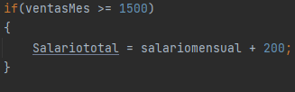
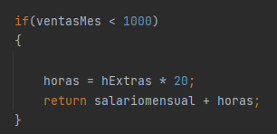
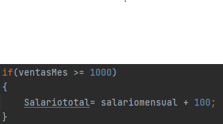
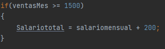

# Documentacion de uso JUNIT 4

## Creando casos de prueba
### Crear una clase Empleado con los atributos comunes como nombre, apellidos, cedula, tipo-empleado (VENDEDOR, ENCARGADO, NINGUNO), horas extras y ventas en el mes. Para calcular el salario bruto, tenga en cuenta lo siguiente: El salario base es de 1000 dólares si el empleado es de tipo vendedor, y de 1500 dólares si es de tipo encargado. A esta cantidad se le debe sumar una 100 dólares si las ventas del mes son mayor o igual que 1000 dólares, y de 200 dólares si fuese al menos de 1500 dólares. Por último, cada hora extra se pagará a 20 dólares, si tipo de empleado es null, o ventas del mes o horas extra toman valores negativos el método debe lanzar una excepción personalizada que diga el error relacionado.

## Creacion de clase principal
### Para la creacion de la clase principal creamos la clase llamada Empleado, donde podremos realizar todas las funciones que se nos facilita.

## Creacion del metodo

## Se crean la logica del metodo para la realizaciones matematicas a utilizar con el empleado de tipo vendedor
### Como primer caso se identifican las variables a utilizar que se iban a utilizar por las funciones aritmeticas, dentro de la condicional de para el empleado de tipo vendedor, que es una de las primeras variables que se va a usar del metodo creado.

### Logica de las condicionales

### Uso de la segunda varible de metodo que es ventaMes, donde como el enunciado lo explica si las ventas de ese mes son iguales o mayores de 1000 dolares a su salario total, se le sumara su salariomensual mas 100 dolares

### Uso de la segunda condicional nos dice que si las ventas del mes son mayores o iguales 1500 dolares se le sumara a su salario mensual 200 dolares.

### luego de esto realizamos otras operaciones matematica que haran uso de la tercera variable del metodo de las horas extras, donde a horas se le sumara las horas extras por 20mdolares mas por cada hora que haga en su trabajo de manera extra, con que el empleado de tipo  vendedor tendra el valor de el salsario total mas las horas, que tendran el valor de las horas extras, y retornaremos el valor matematico.

## Logica de las condicionales para el empleado de tipo encargado.

### Primero se debe crear que si el empleado es de tipo encargado se cumpliran las condicionales siguientes, con las variables que se le asignan a utilizar, que son similares a las demas varibles utilizado al en el antiguo tipo de vendedor.

### Se crea las primer condicional para el empleado de tipo encargado, si las ventas de este tipo de empleado, si su ventas del mes son menores a 1000 dolares , se le retornara el salario mensual mas las horas, que estan estan en realizadas en horas que vale horas entras por 20 que sera el saldo a pagar por cada hora trabajada fue de su horario laboral

### Validacion de la segunda condicional para el empleado de tipo encargado que si las ventas del mes son menores de o iguales a 1000 dolares a su salario total se le sumara 100 colares

### En la tercera condicional si las ventas del mes son mayores o iguales a 1500 dolares se le sumaran 200 dolares.

### al final se hara la actividad aritmetica de la sumatoria y multiplicacion de las horas extras y los datos que retornara en los Test

## Creacion de los Test de Empleados de tipo vendedor y de tipo encargado

### Se crean Test para poder comprobar si las operaciones matematicas cumplen para poder no tener margenes de error, o comprobacion de estas funciones o metodos.

### en este Test logramos comprobar que todos los empelados de tipo vendedor. donde creamos una nueva variable que nos permitira atrar los valores de nuestra clase principal, en expected colocaremos el valor que se espera como se nos muestra en la parte de la logica de las funciones aritmeticas, ene ste caso como ejemplo tenemos el valor de 1360, que es el valor esperado, llamamos al metodo de carcular el salario, donde el tipo de empleado es de tipo vendeddor, con el valor de pago mensual, de 2000 y sus horas extras compuestas de 8 horas.

### Lo mismo seria para el empleado de tipo encargado

## Crear metodo para el salario neto.
### Para este metodo necesitamos condicionales que nos permiten realizar todos los incisos que se nos piden acontinuacion:
## Asignación de cálculo de salario neto
Si el salario bruto es menor de 1000 dólares, no se aplicará ninguna retención. Para salarios a partir de 1000 dólares, y menores de 1500 dólares se les aplicará un 16%, y a los salarios a partir de 1500 dólares se les aplicará un 18%. El método nos devolverá salarioBruto * (1-retencion), o EmpExcepcion si el salario es menor que cero.

### En este apartado el primer de la condicional podemos ver que si el salario es menor de 1000 dolares, retornara el salario bruto que tenga el empleado.
### la segunda condicional tiene que si el salario es mayor o igual a 1000 y es menor de 1500 entonces a este salario se le aplcara un 16% de deducciones y retornara el salario neto, la tercera condicional hace exactamente lo mismo solo que con un margen de mayor de 1500 dolares con una restrccion de 18% 

## Creacion de test de Cacular salario Neto
### Podemos ver que tiene la misma logica que los demas test con el equivalente que solo se agregan los valores de 2 salarios el Salario Neto a esperar, y el salario Bruto que se esta ingresando.

